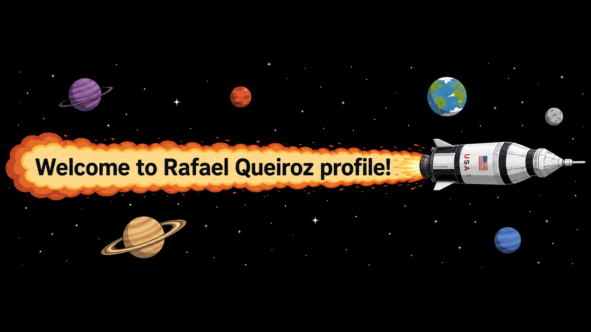

  

# 👋 Olá, eu sou Rafael Queiroz

🎓 Estudante de Ciência da Computação na CESAR School

Sou apaixonado por tecnologia, desenvolvimento de software e resolução de problemas. Atualmente estou construindo minha base em programação, algoritmos, estruturas de dados e desenvolvimento de sistemas, sempre buscando aprender novas tecnologias e aplicá-las em projetos práticos.

## 🚀 Sobre mim

- 🎓 Graduando em Ciência da Computação na CESAR School
- 💻 Interesse em Desenvolvimento de Software, Inteligência Artificial, Engenharia de Software e Segurança
- 📚 Sempre estudando novas tecnologias e aprimorando minhas habilidades técnicas
- 🏋️ Disciplina e constância através de treino e desenvolvimento pessoal
- 🎯 Focado em crescimento contínuo e aprendizado de longo prazo

## 🛠️ Tecnologias e Ferramentas

### Linguagens
- Python
- JavaScript

### Desenvolvimento
- Git & GitHub
- Arduino
- HTML & CSS

### Atualmente Aprendendo
- Desenvolvimento Web
- Inteligência Artificial
- Banco de Dados

## 📈 Objetivos

Meu objetivo é desenvolver soluções que gerem impacto real, construir projetos relevantes e crescer como profissional da tecnologia através de aprendizado contínuo, colaboração e experiência prática.

## 📫 Contato

- LinkedIn: www.linkedin.com/in/rafael-queiroz-365bb1265
- Email: rafaqza@gmail.com

---
